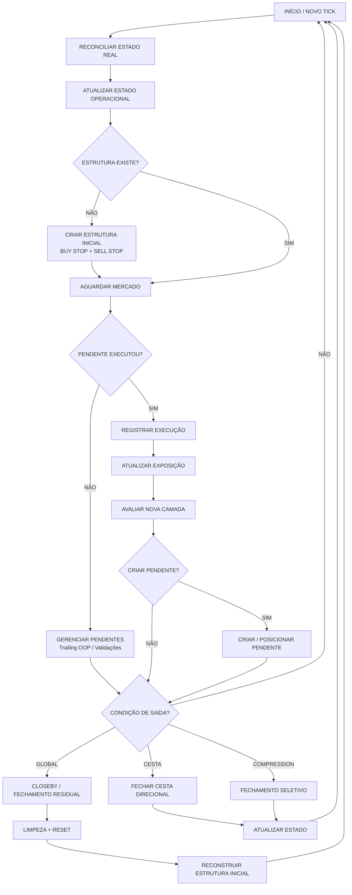

# ZGOLD — Fluxo Operacional V1

## Objetivo

Este documento define o fluxo operacional de referência do ZGOLD para a equipe. O fluxo separa claramente **mercado**, **reconciliação**, **execução**, **expansão** e **saídas**.

## Regra fundamental

A criação da estrutura inicial de dois pendentes **não encerra o ciclo operacional**. Depois dela, o EA entra em estado de acompanhamento e retorna ao fluxo a cada novo tick.

A expansão não deve ser interpretada como consequência da simples existência de pendentes. A transição operacional relevante é:

`PENDING -> MARKET EXECUTION -> RECONCILIAR -> ATUALIZAR EXPOSIÇÃO -> AVALIAR EXPANSÃO`

## Fluxo principal

## Ordem conceitual por tick

1. **Novo tick** — recebe Bid/Ask/tempo/spread.
2. **Reconcile** — reconstrói o estado a partir das ordens reais.
3. **Estado operacional** — determina exposição, pendentes e ciclo atual.
4. **Estrutura inicial** — somente quando não existe posição nem pendente.
5. **Gerenciamento de pendentes** — trailing OOP e validações.
6. **Detecção de execução** — identifica `PENDING -> MARKET`.
7. **Expansão** — após execução, avalia nova camada e lote.
8. **Saídas** — global, cesta ou compression, conforme decisão disponível.
9. **Ação** — executa somente a decisão selecionada.
10. **Próximo tick** — retorna ao início do ciclo.

## Importante para implementação

- `EnsureInitialStructure()` representa **somente reconstrução da estrutura quando o ciclo está vazio**.
- A presença de BUY STOP + SELL STOP significa **AGUARDAR / GERENCIAR**, não finalizar o processamento.
- `PENDING -> MARKET` deve ser tratado como evento de ciclo e pode disparar avaliação de expansão.
- A existência de outro pending não deve ser usada como bloqueio global de toda expansão.
- A geometria exata da nova camada permanece sujeita às evidências da auditoria; `Step`, `TwoStep`, `MinDistance` e `TwoMinDistance` não devem ser convertidos em uma regra universal sem evidência causal.
- Prioridades entre Basket, Compression e Global permanecem não determinadas quando houver conflito simultâneo.

## Referência arquitetural

`TICK -> RECONCILE -> STATE -> EVENT/DECISION -> ACTION -> NEXT TICK`

A estrutura inicial é apenas uma ação dentro desse ciclo; não é o ciclo inteiro.
